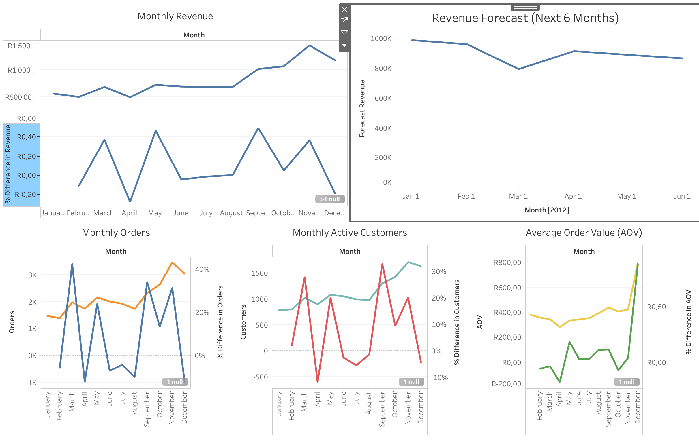

# ecommerce-kpi-dashboard
# 📊 E-commerce KPI Dashboard (Tableau + Python)

Interactive analytics dashboard analyzing Revenue, Orders, Customers and AOV with forecasting and growth insights.

---

## 🚀 Project Overview

This project builds an end-to-end analytics workflow:

- Data cleaning & enrichment in Python
- KPI and MoM growth analysis
- Forecasting future revenue trends
- Interactive Tableau dashboard

---

## 📈 Dashboard Preview

---

## 🔎 Key Insights

- Revenue shows long-term upward trend with recent slowdown
- Strong correlation between Revenue, Orders and Customers
- Seasonality detected in growth spikes
- Forecast indicates moderate future growth

---

## Tools

- Python (Pandas, Matplotlib)
- Tableau Public
- Forecasting (Tableau built-in)

---

## 📂 Project Structure

data/ → raw & cleaned datasets
notebook/ → Python analysis
tableau/ → Tableau packaged dashboard
images/ → dashboard preview

---

## 📊 Tableau Dashboard

👉 Tableau Public link: (https://public.tableau.com/app/profile/nikolaos.giannoulis/viz/ecommerce_dashboard_twbx/Dashboard1)
